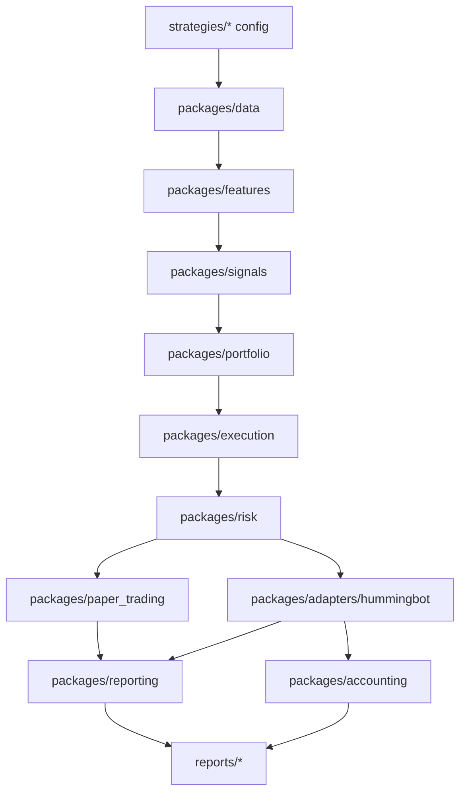
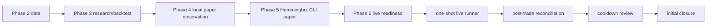

# Code Structure Map

生成日期：2026-04-28

用途：这份文档用于快速定位代码。它按系统分层、包职责、关键类和命令入口整理，不覆盖所有 `_private_helper`，但覆盖当前 v0 主流程需要阅读和维护的主要代码。

## 顶层结构

```text
quant-system/
├── main.py                         # 安全入口，不启动实盘交易
├── docs/                           # 架构、路线、部署、风控、v0 功能清单
├── strategies/                     # 策略配置和少量策略构造函数
├── packages/                       # 核心系统代码
├── reports/                        # 各阶段产物、报告、审计证据
├── ops/                            # 人工操作脚本
└── tests/unit/                     # 单元测试
```

## 系统分层图



核心原则：策略只产生信号；组合生成目标仓位；执行层生成订单意图；风控批准后才允许进入 paper 或 Hummingbot 适配层。

## V0 主流程图



## 按需求找代码

| 你要找什么 | 优先看哪里 |
| --- | --- |
| 核心数据模型 | `packages/core/models.py`、`packages/core/enums.py` |
| K 线下载/导入/SQLite | `packages/data/binance_klines.py`、`packages/data/sqlite_candle_repository.py`、`packages/data/import_candles.py` |
| 数据覆盖查询 | `packages/data/market_data_service.py`、`packages/data/strategy_data_config.py` |
| 指标和信号 | `packages/features/*`、`packages/signals/*`、`strategies/*/signal.py` |
| 回测 | `packages/backtesting/engine.py`、`packages/backtesting/simulator.py` |
| 参数扫描/稳健性 | `packages/backtesting/parameter_scan.py`、`train_test_validation.py`、`walk_forward.py` |
| 组合和仓位 | `packages/portfolio/*` |
| 风控和 kill switch | `packages/risk/*` |
| 订单意图和路由 | `packages/execution/*` |
| 本地 paper trading | `packages/paper_trading/cycle.py`、`observation.py`、`ledger.py` |
| Hummingbot sandbox/paper 对接 | `packages/adapters/hummingbot/sandbox*.py`、`cli_direct_paper_handoff.py` |
| Hummingbot live 前门禁 | `packages/reporting/live_readiness.py`、`live_activation.py`、`packages/adapters/hummingbot/live_connector_preflight.py` |
| 真实 one-shot live runner | `packages/adapters/hummingbot/live_one_batch_runner.py` |
| live 后对账 | `packages/adapters/hummingbot/live_post_trade.py` |
| cooldown / 初始闭环 | `packages/adapters/hummingbot/live_cooldown_review.py`、`live_initial_closure.py` |
| 税务基础导出 | `packages/accounting/tax_export.py` |
| 命令行入口 | 各包里的 `run_*.py` |

## `packages/core`

系统基础类型，不依赖业务阶段。

| 文件 | 主要类/函数 | 功能 |
| --- | --- | --- |
| `core/enums.py` | `MarketType`、`OrderSide`、`PositionSide`、`OrderType`、`TimeInForce`、`SignalDirection`、`RiskDecisionStatus`、`OrderStatus` | 全系统稳定枚举，避免字符串散落 |
| `core/models.py` | `MarketSymbol` | 交易所、市场类型、base/quote 的统一标识 |
| `core/models.py` | `Candle`、`FundingRate`、`OrderBookLevel`、`OrderBookSnapshot` | 行情数据模型 |
| `core/models.py` | `Signal` | 策略信号输出 |
| `core/models.py` | `PortfolioPosition`、`AccountSnapshot` | 账户和持仓快照 |
| `core/models.py` | `OrderRequest`、`OrderState` | 订单请求和订单状态 |
| `core/events.py` | `DomainEvent`、`SignalGenerated`、`RiskDecisionMade`、`ExecutionReportReceived` | 领域事件模型 |
| `core/exceptions.py` | `QuantSystemError`、`ConfigurationError`、`RiskRejectedError`、`ExecutionError`、`HummingbotAdapterError` | 项目内异常层级 |

## `packages/data`

行情数据接入、存储、查询和质量检查。

| 文件 | 主要类/函数 | 功能 |
| --- | --- | --- |
| `data/binance_klines.py` | `BinanceSpotKlineConfig`、`BinanceSpotKlineClient` | Binance spot public K 线下载 |
| `data/binance_klines.py` | `to_binance_symbol`、`expected_candle_count`、`iter_expected_opens` | 交易对格式和时间序列辅助 |
| `data/csv_candle_source.py` | `CandleCSVReadResult`、`read_candles_csv`、`write_candles_csv` | CSV K 线读写 |
| `data/data_quality.py` | `CandleQualityIssue`、`CandleQualityReport`、`build_candle_quality_report` | 数据质量报告 |
| `data/candle_repository.py` | `CandleRepository`、`InMemoryCandleRepository` | K 线仓库协议和内存实现 |
| `data/sqlite_candle_repository.py` | `SQLiteCandleRepository` | SQLite K 线持久化仓库 |
| `data/market_data_refresh.py` | `MarketDataRefreshResult`、`refresh_binance_spot_candles`、`latest_closed_candle_end` | 已收盘 K 线刷新 |
| `data/market_data_service.py` | `CandleQuery`、`CandleQueryResult`、`MarketDataService` | 策略统一查询行情数据 |
| `data/strategy_data_config.py` | `StrategyDataConfig`、`load_strategy_data_config` | 从策略配置生成数据查询 |
| `data/timeframes.py` | `interval_to_timedelta`、`expected_interval_count`、`floor_datetime_to_interval` | 时间周期工具 |
| `data/trade_repository.py` | `Trade`、`InMemoryTradeRepository` | 成交数据仓库占位 |
| `data/order_book_repository.py` | `InMemoryOrderBookSnapshotRepository` | 订单簿快照仓库占位 |
| `data/funding_rate_repository.py` | `InMemoryFundingRateRepository` | 资金费率仓库占位 |
| `data/simple_yaml.py` | `load_simple_yaml` | 项目内简单 YAML 解析器 |

命令入口：

- `data/download_binance_candles.py`
- `data/import_candles.py`
- `data/load_candles_sqlite.py`
- `data/query_strategy_candles.py`

## `packages/features`

特征和技术指标。

| 文件 | 主要类/函数 | 功能 |
| --- | --- | --- |
| `features/indicators.py` | `simple_moving_average`、`rolling_high`、`rolling_low` | 基础技术指标 |
| `features/momentum.py` | `rate_of_change` | 动量/收益变化率 |
| `features/volatility.py` | `close_to_close_volatility` | 收盘价波动率 |
| `features/market_regime.py` | `MarketRegime`、`classify_regime` | 市场状态分类 |

## `packages/signals`

策略信号接口和基础信号实现。

| 文件 | 主要类 | 功能 |
| --- | --- | --- |
| `signals/base_signal.py` | `BaseSignal` | 信号基类 |
| `signals/trend_signal.py` | `MovingAverageTrendSignal` | 均线趋势信号 |
| `signals/mean_reversion_signal.py` | `MeanReversionSignal` | 均值回归信号 |
| `signals/funding_rate_signal.py` | `FundingRateSignal` | 资金费率信号占位 |

## `strategies`

策略配置目录，保存策略参数、组合参数、风控参数和少量策略构造函数。

| 目录 | 主要文件 | 功能 |
| --- | --- | --- |
| `strategies/btc_trend_v1` | `signal.py`、`config.yml`、`risk.yml` | BTC 趋势策略样例 |
| `strategies/crypto_momentum_v1` | `signal.py`、`backtest.yml`、`portfolio.yml`、`risk.yml` | 初始动量回测策略 |
| `strategies/crypto_relative_strength_v1` | `config.yml`、`backtest.yml`、`portfolio.yml`、`risk.yml`、`risk.live.phase_6_2.yml` | 当前 v0 主策略：大币种相对强弱轮动 |
| `strategies/grid_filter_v1` | `regime_filter.py`、`config.yml`、`risk.yml` | 网格策略状态过滤样例 |

## `packages/backtesting`

历史回测、参数扫描和稳健性验证。

| 文件 | 主要类/函数 | 功能 |
| --- | --- | --- |
| `backtesting/config.py` | `BacktestConfig`、`SignalBacktestConfig`、`PortfolioBacktestConfig`、`RegimeFilterBacktestConfig` | 回测配置模型 |
| `backtesting/engine.py` | `BacktestEngine` | 回测主引擎 |
| `backtesting/simulator.py` | `Simulator`、`MomentumBacktestSimulator` | 策略模拟器 |
| `backtesting/result.py` | `BacktestTrade`、`EquityPoint`、`BacktestResult` | 回测结果模型 |
| `backtesting/metrics.py` | `total_return`、`max_drawdown`、`turnover`、`tail_loss`、`average` | 绩效指标 |
| `backtesting/cost_model.py` | `percentage_fee` | 手续费模型 |
| `backtesting/slippage_model.py` | `bps_slippage_price` | 滑点模型 |
| `backtesting/parameter_scan.py` | `ParameterGrid`、`SelectionPolicy`、`ParameterScanRunner`、`ParameterScanResult` | 参数扫描 |
| `backtesting/train_test_validation.py` | `TrainTestSplit`、`TrainTestValidationRunner`、`TrainTestValidationResult` | train/test 验证 |
| `backtesting/walk_forward.py` | `WalkForwardFold`、`WalkForwardRunner`、`WalkForwardResult` | walk-forward 验证 |

命令入口：

- `backtesting/run_backtest.py`
- `backtesting/run_parameter_scan.py`
- `backtesting/run_train_test_validation.py`
- `backtesting/run_walk_forward.py`

## `packages/portfolio`

组合目标和仓位计算。

| 文件 | 主要类/函数 | 功能 |
| --- | --- | --- |
| `portfolio/portfolio_state.py` | `PortfolioState` | 当前组合状态 |
| `portfolio/portfolio_target.py` | `PortfolioTarget` | 目标权重/目标仓位 |
| `portfolio/allocation.py` | `equal_weight` | 等权分配 |
| `portfolio/position_sizing.py` | `quantity_from_notional` | 名义金额转数量 |

## `packages/risk`

账户级风控和 kill switch。

| 文件 | 主要类 | 功能 |
| --- | --- | --- |
| `risk/account_limits.py` | `AccountRiskLimits` | 账户级风险限额 |
| `risk/kill_switch.py` | `KillSwitch` | 手动/自动 kill switch 状态 |
| `risk/risk_decision.py` | `RiskDecision` | 风控审批结果 |
| `risk/risk_engine.py` | `RiskEngine` | 检查 kill switch、订单名义金额、单币种/总敞口等限制 |

## `packages/execution`

订单意图、执行策略、路由和对账存储。

| 文件 | 主要类 | 功能 |
| --- | --- | --- |
| `execution/order_intent.py` | `OrderIntent` | 风控前后的标准订单意图 |
| `execution/execution_policy.py` | `ExecutionPolicy`、`MarketOrderPolicy` | 把目标转换为市价单等执行策略 |
| `execution/order_router.py` | `ExecutionClient`、`RoutedOrder`、`OrderRouter` | 风控通过后路由给执行客户端 |
| `execution/reconciliation.py` | `ReconciliationStore` | 执行回报对账存储占位 |

## `packages/paper_trading`

本地 paper trading 和 observation loop。

| 文件 | 主要类/函数 | 功能 |
| --- | --- | --- |
| `paper_trading/cycle.py` | `PaperTradingCycle`、`PaperCycleResult` | 单轮 paper 交易：读数据、算目标、生成订单、风控、模拟成交 |
| `paper_trading/execution_client.py` | `PaperExecutionClient` | 本地模拟成交客户端 |
| `paper_trading/ledger.py` | `PaperOrderRecord`、`PaperLedger`、`make_paper_order_id` | JSONL paper ledger 和权益/持仓重建 |
| `paper_trading/observation.py` | `PaperObservationLoop`、`PaperObservationSummary` | 多轮 observation、summary 和 Markdown report |
| `paper_trading/runtime.py` | `assert_readiness`、`load_risk_limits`、`load_kill_switch` | paper runtime 前置检查 |

命令入口：

- `paper_trading/run_paper_cycle.py`
- `paper_trading/run_paper_observation.py`

## `packages/adapters/hummingbot`

Hummingbot 适配层。这里是项目当前最重要的执行边界：生成 handoff、读取 Hummingbot events、做对账、生成 live runner，但不把 API key 存在本仓库。

### 基础适配

| 文件 | 主要类 | 功能 |
| --- | --- | --- |
| `hummingbot_api_client.py` | `HummingbotAPIConfig`、`HummingbotAPIClient` | Hummingbot API 客户端封装 |
| `executor_client.py` | `HummingbotExecutorClient` | Hummingbot 执行客户端占位/边界 |
| `order_mapper.py` | `OrderMapper` | 系统订单和 Hummingbot 订单字段映射 |
| `controller_config_builder.py` | `ControllerConfigSpec`、`ControllerConfigBuilder` | 生成 Strategy V2 controller 配置 |

### Sandbox / Paper Handoff

| 文件 | 主要类/函数 | 功能 |
| --- | --- | --- |
| `sandbox.py` | `SandboxPrepareResult`、`prepare_hummingbot_sandbox`、`build_sandbox_manifest`、`simulate_sandbox_lifecycle` | 从 paper ledger 生成 sandbox manifest 并模拟生命周期 |
| `sandbox_reconciliation.py` | `SandboxRuntimeEvent`、`SandboxReconciliationThresholds`、`SandboxReconciliationResult`、`build_sandbox_reconciliation` | 标准化 Hummingbot events 并对账 |
| `sandbox_session.py` | `SandboxSessionGateResult`、`build_sandbox_session_gate` | sandbox session 准入门禁 |
| `sandbox_package.py` | `SandboxPackageResult`、`build_sandbox_package` | 导出 manifest、orders、schema、runbook |
| `sandbox_export_acceptance.py` | `SandboxExportAcceptanceResult`、`build_sandbox_export_acceptance` | 接收真实 Hummingbot export 并验收 |
| `runtime_preflight.py` | `ConnectorConfigFinding`、`HummingbotRuntimePreflightResult`、`build_runtime_preflight` | 扫描本机 Hummingbot runtime，避免误加载 live connector |
| `cli_paper_handoff.py` | `CliPaperHandoffResult`、`build_cli_paper_handoff` | Strategy V2 controller paper handoff |
| `cli_direct_paper_handoff.py` | `CliDirectPaperHandoffResult`、`build_cli_direct_paper_handoff` | 当前采用的 CLI direct paper handoff |
| `observation_review.py` | `HummingbotObservationThresholds`、`HummingbotObservationReview`、`build_hummingbot_observation_review` | Hummingbot observation window 复盘 |

### Live Readiness / Live Batch

| 文件 | 主要类/函数 | 功能 |
| --- | --- | --- |
| `live_connector_preflight.py` | `LiveConnectorCheckItem`、`LiveConnectorPreflightReport`、`build_live_connector_preflight` | 检查真实 connector 配置、allowlist、signoff、风险配置，不输出密钥值 |
| `live_batch_activation_plan.py` | `LiveBatchPlanCheckItem`、`LiveBatchActivationPlan`、`build_live_batch_activation_plan` | 首次小资金 live batch 计划和门禁 |
| `live_batch_execution_package.py` | `CandidateLiveOrder`、`LiveBatchExecutionPackage`、`build_live_batch_execution_package` | 基于最新行情生成候选 live order package |
| `live_one_batch_runner.py` | `LiveOneBatchRunnerPackage`、`build_live_one_batch_runner_package` | 生成一次性 Hummingbot live runner 脚本和配置 |
| `live_post_trade.py` | `LiveTradeFill`、`LivePostTradeReport`、`build_live_post_trade_report` | 真实成交后对账、日报和 tax export |
| `live_cooldown_review.py` | `LiveCooldownReview`、`build_live_cooldown_review` | 24 小时冷却复盘，检查 runner/config/container/event log 状态 |
| `live_initial_closure.py` | `InitialClosureReport`、`build_initial_closure_report` | 初始 v0 闭环和 BTC 仓位生命周期计划 |

命令入口：

- `run_sandbox_prepare.py`
- `run_sandbox_reconciliation.py`
- `run_sandbox_session_gate.py`
- `run_sandbox_package.py`
- `run_sandbox_export_acceptance.py`
- `run_runtime_preflight.py`
- `run_cli_paper_handoff.py`
- `run_cli_direct_paper_handoff.py`
- `run_observation_review.py`
- `run_live_connector_preflight.py`
- `run_live_batch_activation_plan.py`
- `run_live_batch_execution_package.py`
- `run_live_one_batch_runner.py`
- `run_live_post_trade.py`
- `run_live_cooldown_review.py`
- `run_live_initial_closure.py`

## `packages/reporting`

报告、准入检查和阶段性门禁。

| 文件 | 主要类/函数 | 功能 |
| --- | --- | --- |
| `reporting/paper_readiness.py` | `PaperReadinessThresholds`、`PaperReadinessReport`、`build_paper_readiness_report`、`build_risk_off_runbook` | Phase 3.9 paper readiness 和 risk-off runbook |
| `reporting/paper_observation_review.py` | `PaperObservationReviewThresholds`、`PaperObservationReview`、`build_paper_observation_review` | Phase 4 observation 复盘 |
| `reporting/daily_report.py` | `DailyReport`、`HummingbotDailyReport`、`build_hummingbot_daily_report` | Hummingbot 日报 |
| `reporting/live_readiness.py` | `LiveReadinessThresholds`、`LiveReadinessReport`、`build_live_readiness_report` | Phase 6.1 live readiness |
| `reporting/live_activation.py` | `ActivationChecklistItem`、`LiveActivationChecklist`、`build_live_activation_checklist` | Phase 6.2 live activation checklist |
| `reporting/performance_report.py` | `PerformanceReport` | 通用绩效报告占位 |
| `reporting/strategy_report.py` | `StrategyReport` | 策略报告占位 |

命令入口：

- `run_paper_readiness_report.py`
- `run_paper_observation_review.py`
- `run_hummingbot_daily_report.py`
- `run_live_readiness.py`
- `run_live_activation_checklist.py`

## `packages/accounting`

费用、PnL、仓位账本和税务基础导出。

| 文件 | 主要类/函数 | 功能 |
| --- | --- | --- |
| `accounting/fees.py` | `trading_fee` | 手续费计算 |
| `accounting/pnl.py` | `linear_realized_pnl` | 线性已实现 PnL |
| `accounting/positions.py` | `PositionLedger` | 仓位账本占位 |
| `accounting/tax_export.py` | `TaxLotRow`、`TradeTaxExportRow`、`TradeTaxExportSummary` | 税务导出行和摘要 |
| `accounting/tax_export.py` | `build_trade_tax_export_rows_from_hummingbot_events`、`build_trade_tax_export_summary` | 从 Hummingbot fills 生成 trade/tax export |

命令入口：

- `accounting/run_hummingbot_tax_export.py`

## `packages/observability`

轻量监控、告警和指标模型。

| 文件 | 主要类/函数 | 功能 |
| --- | --- | --- |
| `observability/alerts.py` | `Alert`、`AlertPublisher`、`info_alert`、`warning_alert`、`critical_alert` | 统一告警对象 |
| `observability/health_check.py` | `HealthCheckResult` | 健康检查结果 |
| `observability/metrics.py` | `GaugeRegistry` | 简单 gauge 指标注册 |
| `observability/logger.py` | `get_logger` | 日志工具 |

## `ops`

人工操作脚本，当前只有低资金 live batch 启动脚本。

| 文件 | 功能 |
| --- | --- |
| `ops/run_phase_6_6_live_once_low_funds_50.sh` | 本地安全输入 Hummingbot password，停止普通 `hummingbot` 容器，并启动一次性 low-funds live runner |

## `tests/unit`

当前单元测试覆盖主要关键路径。

| 测试范围 | 代表文件 |
| --- | --- |
| 数据层 | `test_binance_klines.py`、`test_sqlite_candle_repository.py`、`test_market_data_refresh.py`、`test_market_data_service.py` |
| 回测研究 | `test_backtest_engine.py`、`test_parameter_scan.py`、`test_train_test_validation.py`、`test_walk_forward.py` |
| 风控与执行 | `test_risk_engine.py`、`test_order_router.py`、`test_paper_trading.py` |
| paper readiness / observation | `test_paper_readiness.py`、`test_paper_observation_review.py` |
| Hummingbot sandbox/paper | `test_hummingbot_sandbox*.py`、`test_hummingbot_cli*_handoff.py`、`test_hummingbot_observation_review.py` |
| live readiness / execution / closure | `test_live_readiness.py`、`test_live_activation.py`、`test_hummingbot_live_*.py` |
| tax export | `test_tax_export.py` |

## 入口脚本命名规则

- `run_*.py`：命令行执行入口。
- 非 `run_*.py`：通常是可测试的业务逻辑、数据模型、报告构建器。
- `build_*`：一般是纯构建/聚合函数，输入 JSON/config，输出 dataclass/report。
- `write_*`：把 report 或数据写成 JSON、Markdown、CSV、JSONL。
- `load_*`：读取 JSON、YAML、JSONL 或配置。

## 阅读顺序建议

1. 先读 `docs/architecture.md` 和 `docs/v0_feature_inventory.md`，理解系统边界和当前深度。
2. 再读 `packages/core/models.py`、`packages/core/enums.py`，掌握统一模型。
3. 如果看研究链路：按 `data -> features -> signals -> backtesting -> reporting`。
4. 如果看 paper 链路：按 `paper_trading/cycle.py -> paper_trading/ledger.py -> paper_trading/observation.py`。
5. 如果看 Hummingbot 链路：按 `sandbox_reconciliation.py -> cli_direct_paper_handoff.py -> live_one_batch_runner.py -> live_post_trade.py`。
6. 如果看 live 安全链路：按 `live_readiness.py -> live_activation.py -> live_connector_preflight.py -> live_batch_activation_plan.py -> live_cooldown_review.py -> live_initial_closure.py`。
